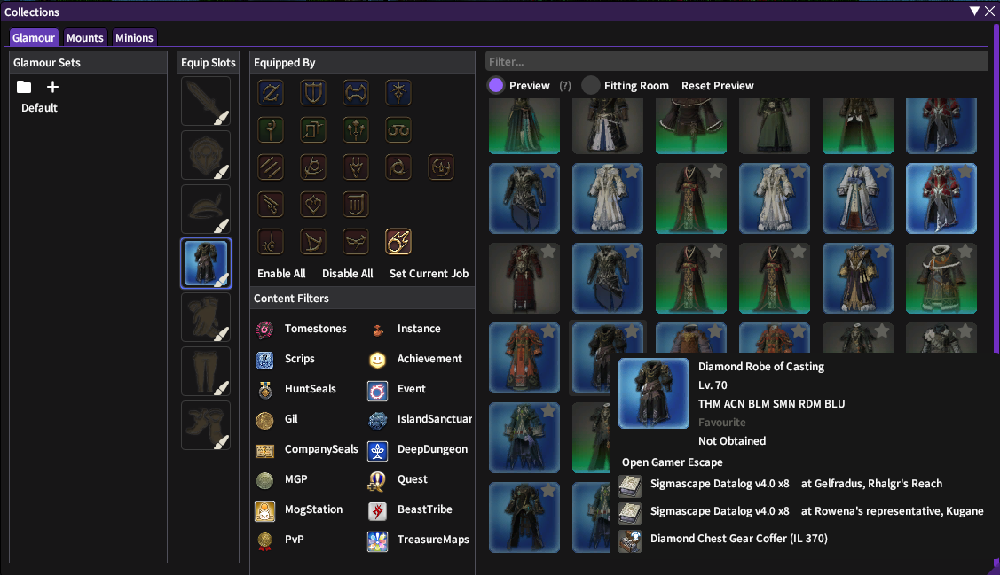
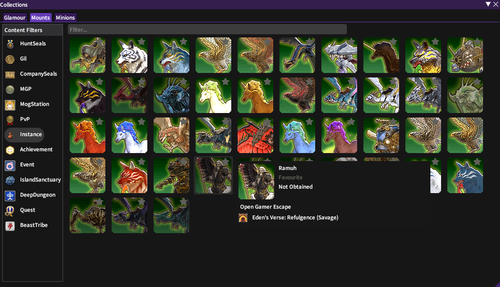
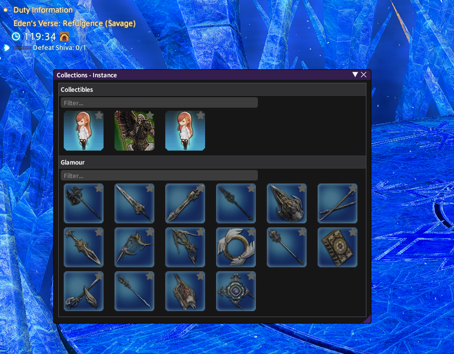
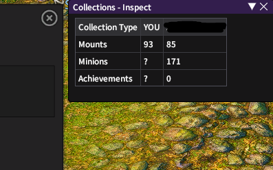

# Collections

## Disclaimer
This is a very initial version of the plugin (pretty much a POC), more functionality is planned.

Feel free to add any suggestions/issues.

For reaching out on discord: `seventh0`

## Plugin

Collections plugin for Dalamud.

Provides an interface to track and discover collectibles.

Glamour, Mounts, Minions and more to come.

## Features
This plugins aims to provide an interface for:
1. Keeping track of your collectibles (What you have or don't have)
2. Find new collectibles that you want to obtain
3. Provide guidance on how to obtain them

### Collection Window

### Instance Window

### Inspect Window

